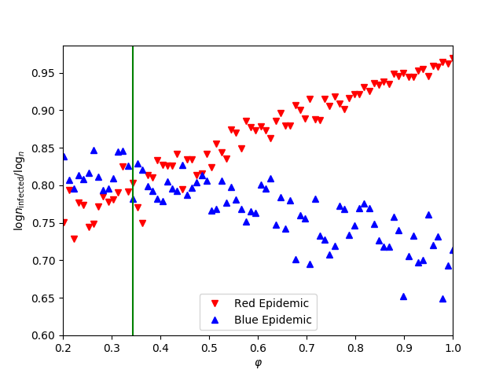

# Competitive SIR with Immunizations
We introduce the competitive SIR model with immunization which is a deviation from the standard SIR model. The model features two epidemics spreading on the network (red and blue epidemics). Each epidemic has a time step and transmissibility, and an infected node will infect its susceptible neighbor through an edge in such time step with given transmissibility, and then recovered from its epidemics. The two epidemics are considered competitive, in which once a node is infected or recovered from one epidemic, it will no longer be infected by the other epidemic. 

This model can also be equipped with immunization features, where a proportion of nodes are immune to both epidemics. We want to determine what level of immunization may kill one rumor but let the other rumor thrive. 

In real world scenario, this model can reflect that the two rumors have a noticeable difference in the rate of updating and levels of persuasion, creating a very complex dynamics. Immunization of users means they are neutral in such social or political debate or weary of spreading any news at all so that this node cannot be infected by either of the epidemics. 

If you are interested, please look into [this](paper.pdf) PDF file for the theoretical and numerical results!

## Requirements
To install all required packages, please type the following command in your terminal:

```bash
pip install -r requirements.txt
```

## Tests
[test.py](tests/test.py) and [test_immunization.py](tests/test_immunization.py) gives two interface for running the simulations. The first gives a general understanding of all the processes included and the later helps simulate the immunization threshold that we are interested.
Use
```bash 
python3 tests/test.py
python3 tests/test_immunization.py
```
to run either of the tests.



This shows how our immunization threshold matches the simulation.

## Acknowledgements

This project is used as the term project for 6.268 Network Science and Models at MIT Spring 2018. Thanks to [	
Patrick Jaillet](http://web.mit.edu/jaillet/www/) for his wonderful class, as well as [Philip Samuel Chodrow](https://philchodrow.github.io/) and [Li Jin](http://web.mit.edu/jnl/www/) for their advice on the project. Finally, thanks to Jingjing Tang for the other side of the project.